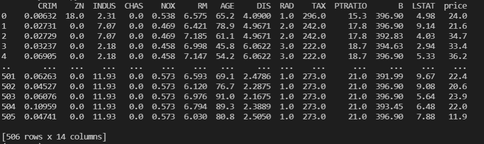
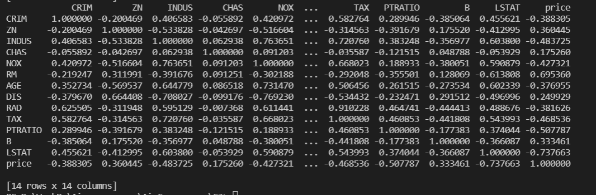
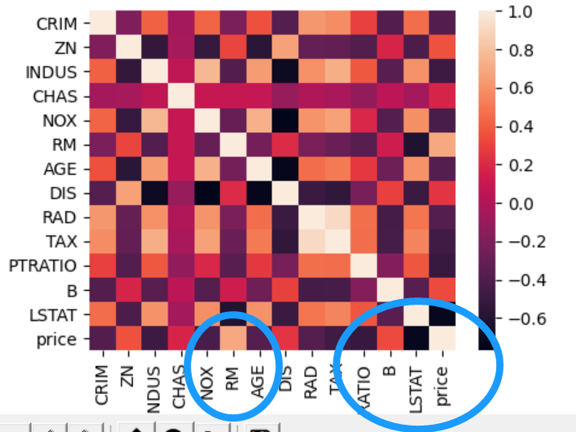
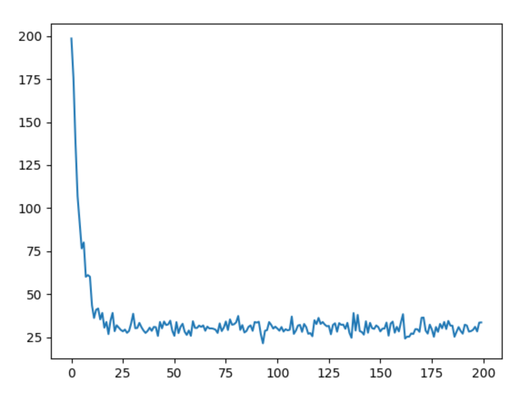
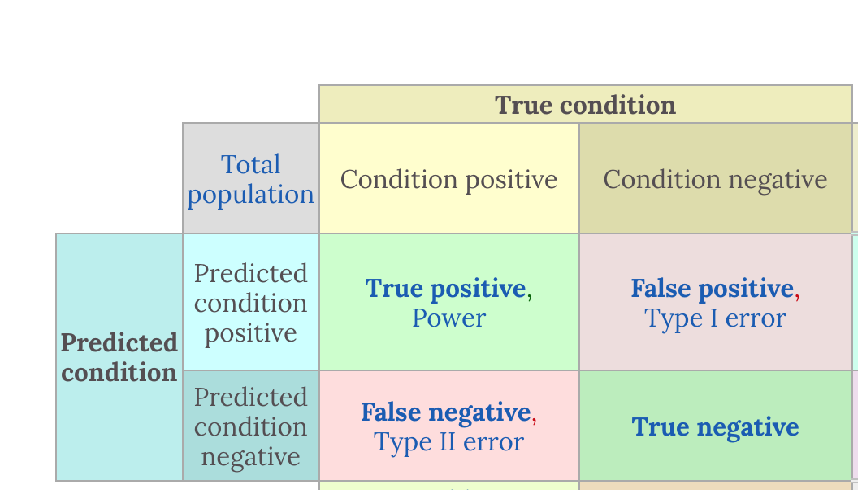
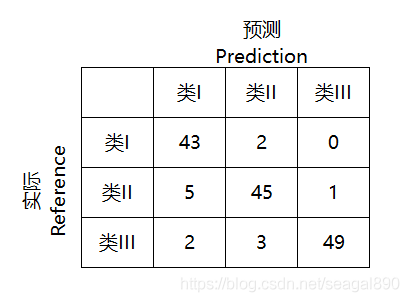
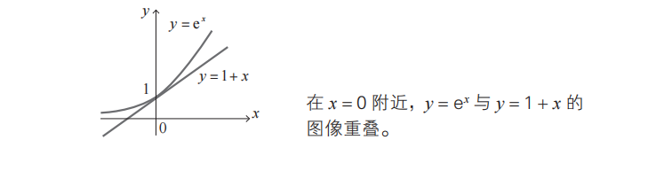

#### 线性关系和线性回归试验

$$
\vec{w}=[w_0,w_1,w_2,\cdots,w_n] \\

\vec{x}=[x_0,x_1,x_2,\cdots,x_n] \\

f(x)= \sum_{i \in N}w_ix_i+b =w_0x_0+w_1+x_1+\cdots+w_nx_n+b=w^Tx+b
$$


$x \in R^1,f(x)$  is a liner

$x \in R^2,f(x)$  is a plane.

<<<<<<< HEAD


#### 线性回归单例演示试验

任务：预测波士顿房价 
=======
#### 任务：预测波士顿房价 
>>>>>>> 420770075f0bba45a01f67c258acf4673d33848a

步骤1：拿到数据集，观察数据

```python
import random
import pandas as pd
import seaborn as sns
import matplotlib.pyplot as plt

from sklearn.datasets import load_boston
mydataset = load_boston()
print(mydataset)

'''
{'data': array([[6.3200e-03, 1.8000e+01, 2.3100e+00, ..., 1.5300e+01, 3.9690e+02,
......
'target': array([24. , 21.6, 34.7, 33.4, 36.2, 28.7, 22.9, 27.1, 16.5, 18.9, 15. ,
......
'feature_names': array(['CRIM', 'ZN', 'INDUS', 'CHAS', 'NOX', 'RM', 'AGE', 'DIS', 'RAD',
       'TAX', 'PTRATIO', 'B', 'LSTAT'], dtype='<U7'), 
'''


```


步骤2：提取数据，并转换成pandas格式

```python
data = mydataset['data']
target = mydataset['target']
columns = mydataset['feature_names']

mydataframe=pd.DataFrame(data)
mydataframe.columns=columns
mydataframe['price']=target

print(mydataframe)
print(mydataframe.shape)
```




步骤3：查看、观察数据相关性

```python

print(mydataframe.corr())
sns.heatmap(mydataframe.corr())
plt.show()
# RM：小区平均的卧室个数
# LSTAT: 低收入人群在周围的比例
# correlation => 如果一个值的增大，会引起另外一个值一定增大，而且是定比例增大 相关系数就越接近于1
# correlation => 0 就是两者之间没有任何关系
# correlation => -1 一个值增大 另外一个值一定减小 而且减小是成相等比例的
```





结论：对房价影响最大的是RM（正相关）和LSTAT（负相关）

步骤4：提取关键数据RM和LSTAT

```python
rm=mydataframe['RM']
lstat =mydataframe['LSTAT']
print(rm)
'''
0      6.575
1      6.421
2      7.185
       ...
504    6.794
505    6.030
Name: RM, Length: 506, dtype: float64
'''
```

步骤5：抽象和简化模型（即房价和RM是线性关系）

```python
def model():
    return np.dot(x, w.T) + b  #矩阵转置和矩阵点积

#x 向量即矩阵x，(rm ,lstat)
#w 向量即矩阵w, (w1,w2) 权重
#b 即偏置b,
```


步骤6：定义损失函数（代价函数）

[复习线性回归相关概念](#线性回归具体思路和流程)

```python
def loss(yhat, y):
    return np.mean(0.5* (yhat - y) ** 2)

#预测值: yhat
#训练数据的正解（price）：y
#numpy的妙用，直接用向量计算（矩阵计算）
```


步骤7：定义损失函数关于$w$ 的偏导函数 ，同理，定义损失函b数关于$b$ 的偏导函数 

```python
def partial_w(x, y, yhat):
    return np.array([np.mean((yhat - y) * x[0]), np.mean((yhat - y) * x[1])])
#向量x[rm,lstat]  x[0]即rm ,x[1]即lstat
#返回的是numpy数组

def partial_b(x, y, yhat):
    return np.mean((yhat - y))

```

步骤8：梯度下降，用已知的$x,y,\hat{y}$   和学习率，计算$\Delta w ,\Delta b$ ,更新$w ,b$

```python
def optimize(w, b, x, y, yhat, pw, pb, learning_rate):
    w = w + -1 * pw(x, y, yhat) * learning_rate
    b = b + -1 * pb(x, y, yhat) * learning_rate
    return w, b
```


步骤9： 定义训练函数，初始话$w$和$b$  ，权重$w:(w_1,w_2)$

```python
def train(model_to_be_train, target, loss, pw, pb):

    w = np.random.random_sample((1, 2)) # w1、w2
    b = np.random.random() # b
    learning_rate = 1e-5  #学习率
    epoch = 200  #训练次数
    losses = []

    for i in range(epoch):
        batch_loss = []
        for batch in range(len(rm)):
            # batch training
            index = random.choice(range(len(rm)))  #随机的取训练数据，
            rm_x, lstat_x = rm[index], lstat[index]
            x = np.array([rm_x, lstat_x])  #组装成np数组
            y = target[index] #对应的正解

            yhat = model_to_be_train(x, w, b)  #计算预测值
            loss_v = loss(yhat, y) #计算当前的损失函数值

            batch_loss.append(loss_v) #追加到np数组中（为了考察loss函数的变化情况）

            w, b = optimize(w, b, x, y, yhat, pw, pb, learning_rate) #梯度下降
			
            if batch % 100 == 0:   #每训练100个数据，输出当前loss函数值
                print('Epoch: {} Batch: {}, loss: {}'.format(i, batch, loss_v))
                
        losses.append(np.mean(batch_loss))  #每轮训练的loss值的平均值，追加到数组

    return model_to_be_train, w, b, losses
```

步骤10：定义单例程序入口函数

```python
if __name__ == "__main__":
    import matplotlib.pyplot as plt
    target = dataframe['price'] #拿到正解
    model, w, b, losses = train(linear, target, loss, partial_w, partial_b)
    #调用训练函数依次传入 线性函数模型，正解，损失函数，关于w和b的偏导函数
    #训练函数
    plt.plot(losses)
    predicate = model(np.array([19, 7]), w, b)
    print(w,b)
    print(predicate)
    '''
[[ 4.70884232 -0.70285339]] 1.5015093415109424
[86.04953964]
    '''
```




#### 逻辑回归（二分类，分类）单例试验


步骤1：增加字段`expensive`  ,定义房价排序前3分之1的房子的`expensive`为1 ，作为训练中的正解

```python
greater_then_most = np.percentile(price, 66)
dataframe['expensive'] = dataframe['price'].apply(lambda p: int(p > greater_then_most))
target = dataframe['expensive']
```

步骤2：引入S型函数，逻辑回归的损失函数已经相对于w和b的偏导

```python

def sigmoid(x):
    return 1 / (1 + np.exp(-x))

def model(x, w, b):
    return sigmoid(np.dot(x, w.T) + b)

def loss(yhat, y):
    return -np.sum(y*np.log(yhat) + (1 - y)*np.log(1 - yhat))

def partial_w(x, y, yhat):
    return np.array([np.sum((yhat - y) * x[0]), np.sum((yhat - y) * x[1])])

def partial_b(x, y, yhat):
    return np.sum((yhat - y))
```


步骤3：复用`train`函数，梯度下降，训练得到要拟合的w和b，并定义阈值测试输出预测结果

```python
model, w, b, losses = train(model, target,loss, partial_w, partial_b)

random_test_indices = np.random.choice(range(len(rm)), size=100)
decision_boundary = 0.5

for i in random_test_indices:
    x1, x2, y = rm[i], lstat[i], target[i]
    predicate = model(np.array([x1, x2]), w, b)
    predicate_label = int(predicate > decision_boundary)

    print('RM: {}, LSTAT: {}, EXPENSIVE: {}, Predicated: {}'.format(x1, x2, y, predicate_label))
```


#### 评测指标：混淆矩阵




#### 混淆矩阵（Confusion Matrix）

在机器学习领域，混淆矩阵（Confusion Matrix），又称为可能性矩阵或错误矩阵。混淆矩阵是可视化工具，特别用于监督学习，在无监督学习一般叫做匹配矩阵。在图像精度评价中，主要用于比较分类结果和实际测得值，可以把分类结果的精度显示在一个混淆矩阵里面。

混淆矩阵的结构一般如下图表示的方法。

##### 混淆矩阵要表达的含义：

混淆矩阵的每一列代表了预测类别，每一列的总数表示预测为该类别的数据的数目；
每一行代表了数据的真实归属类别，每一行的数据总数表示该类别的数据实例的数目；每一列中的数值表示真实数据被预测为该类的数目。


 True Positive（TP）：真正类（真阳性）。样本的真实类别是正类，并且模型识别的结果也是正类。

 False Negative（FN）：假负类（假阴性）。样本的真实类别是正类，但是模型将其识别为负类。

 False Positive（FP）：假正类（假阳性）。样本的真实类别是负类，但是模型将其识别为正类。

 True Negative（TN）：真负类（真阴性）。样本的真实类别是负类，并且模型将其识别为负类。 

 该矩阵可用于易于理解的二类分类问题，但通过向混淆矩阵添加更多行和列，可轻松应用于具有3个或更多类值的问题。

举例
如有150个样本数据，预测为类I，类II，类III 各为50个。分类结束后得到的混淆矩阵为：




每一行之和表示该类别的真实样本数量，每一列之和表示被预测为该类别的样本数量。

第一行第一列中的43表示有43个实际归属第一类的实例被预测为第一类，

同理，第一行第二列的2表示有2个实际归属为第一类的实例被错误预测为第二类。

混淆矩阵是对分类问题的预测结果的总结。使用计数值汇总正确和不正确预测的数量，并按每个类进行细分，这是混淆矩阵的关键所在。混淆矩阵显示了分类模型的在进行预测时会对哪一部分产生混淆。它不仅可以让您了解分类模型所犯的错误，更重要的是可以了解哪些错误类型正在发生。正是这种对结果的分解克服了仅使用分类准确率所带来的局限性。

从混淆矩阵得到分类指标
从混淆矩阵当中，可以得到更高级的分类指标：Accuracy（精确率），Precision（正确率或者准确率），Recall（召回率），Specificity（特异性），Sensitivity（灵敏度）。

##### 计算方法

对于二分类问题，可以将样例根据其真实类别与机器学习器预测类别的组合划分为：

样例总数 = TP + FP + TN + FN。

则可以计算指标：

**精确率（Accuracy）**：精确率是最常用的分类性能指标。可以用来表示模型的精度，即模型识别正确的个数/样本的总个数。一般情况下，模型的精度越高，说明模型的效果越好。

Accuracy = (TP+TN)/(TP+FN+FP+TN)

 $$ Accuracy = \frac {TP+TN}{TP+FN+FP+TN}$$


正确率或者准确率（Precision）：又称为查准率，表示在模型识别为正类的样本中，真正为正类的样本所占的比例。一般情况下，查准率越高，说明模型的效果越好。

Precision = TP/(TP+FP)

 $$Precision= \frac {TP}{TP+FP}$$

召回率（Recall）：又称为查全率，召回率表现出在实际正样本中，分类器能预测出多少。

Recall（召回率） = Sensitivity（敏感指标，True Positive Rate，TPR）= 查全率

表示的是，模型正确识别出为正类的样本的数量占总的正类样本数量的比值。一般情况下，Recall越高，说明有更多的正类样本被模型预测正确，模型的效果越好。

Recall = TP/(TP+FN)

$$Recall = \frac{TP}{TP+FN}$$

 

**查准率和查全率是一对矛盾的指标。一般来说，查准率高时，查全率旺旺偏低；二查全率高时，查准率往往偏低。**


精确率（Accuracy）和正确率（Precision）的区别

Accuracy，不管是哪个类别，只要预测正确，其数量都放在分子上，而分母是全部数据量，说明这个精确率是对全部数据的判断。

而正确率在分类中对应的是某个类别，分子是预测该类别正确的数量，分母是预测为该类别的全部的数量。
或者说，Accuracy是对分类器整体上的精确率的评价，而Precision是分类器预测为某一个类别的精确的评价。

Specificity（特异性）：特异性指标，表示的是模型识别为负类的样本的数量，占总的负类样本数量的比值。

负正类率（False Positive Rate, FPR），计算公式为：FPR=FP/(TN+FP)，计算的是模型错识别为正类的负类样本占所有负类样本的比例，一般越低越好。

Specificity = 1 - FPR 

 

Fβ_Score：Fβ的物理意义就是将正确率和召回率的一种加权平均，在合并的过程中，召回率的权重是正确率的β倍。

F1分数认为召回率和正确率同等重要，F2分数认为召回率的重要程度是正确率的2倍，而F0.5分数认为召回率的重要程度是正确率的一半。比较常用的是F1分数（F1 Score），是统计学中用来衡量二分类模型精确度的一种指标。

F1_Score：数学定义为 F1分数（F1-Score），又称为平衡 F分数（Balanced Score），它被定义为正确率和召回率的调和平均数。在 β=1 的情况，F1-Score的值是从0到1的，1是最好，0是最差。

因此我们知道，计算Precision，Recall，Specificity等只是计算某一分类的特性，而Accuracy和F1-Score是判断分类模型总体的标准。

#### 关于AUC/ROC

ROC/AUC的概念
1. 灵敏度，特异度，真正率，假正率
在正式介绍ROC/AUC之前，我们还要再介绍两个指标，这两个指标的选择也正是ROC和AUC可以无视样本不平衡的原因。这两个指标分别是：灵敏度和（1-特异度），也叫做真正率（TPR）和假正率（FPR）。

灵敏度（Sensitivity） = TP/(TP+FN)

特异度（Specificity） = TN/(FP+TN)

其实我们可以发现灵敏度和召回率是一模一样的，只是名字换了而已。
由于我们比较关心正样本，所以需要查看有多少负样本被错误地预测为正样本，所以使用（1-特异度），而不是特异度。
真正率（TPR） = 灵敏度 = TP/(TP+FN)

假正率（FPR） = 1- 特异度 = FP/(FP+TN)

下面是真正率和假正率的示意，我们发现TPR和FPR分别是基于实际表现1和0出发的，也就是说它们分别在实际的正样本和负样本中来观察相关概率问题。正因为如此，所以无论样本是否平衡，都不会被影响。还是拿之前的例子，总样本中，90%是正样本，10%是负样本。我们知道用准确率是有水分的，但是用TPR和FPR不一样。这里，TPR只关注90%正样本中有多少是被真正覆盖的，而与那10%毫无关系，同理，FPR只关注10%负样本中有多少是被错误覆盖的，也与那90%毫无关系，所以可以看出：如果我们从实际表现的各个结果角度出发，就可以避免样本不平衡的问题了，这也是为什么选用TPR和FPR作为ROC/AUC的指标的原因。

学习中看到一篇文章中提出了一个问题，关于：特异性（Specificity）和灵敏度（Sensitivity）

记录下来，还没有理解。

考虑一个二分类的情况，类别为1和0，我们将1和0分别作为正类（positive）和负类（negative），则实际分类的结果有4种，表格如下：


从这个表格中可以引出一些其它的评价指标：

ACC：classification accuracy，描述分类器的分类准确率
计算公式为：ACC=(TP+TN)/(TP+FP+FN+TN)
BER：balanced error rate
计算公式为：BER=1/2*(FPR+FN/(FN+TP))
TPR：true positive rate，描述识别出的所有正例占所有正例的比例
计算公式为：TPR=TP/ (TP+ FN)
FPR：false positive rate，描述将负例识别为正例的情况占所有负例的比例
计算公式为：FPR= FP / (FP + TN)
TNR：true negative rate，描述识别出的负例占所有负例的比例
计算公式为：TNR= TN / (FP + TN)
PPV：Positive predictive value
计算公式为：PPV=TP / (TP + FP)
NPV：Negative predictive value
计算公式：NPV=TN / (FN + TN)
其中TPR即为敏感度（sensitivity），TNR即为特异度（specificity）。


https://blog.csdn.net/seagal890/article/details/105059498

https://zhuanlan.zhihu.com/p/81560511 数据标准化的迷思之深度学习领域

如何衡量模型的好坏：

\1. accuracy 准确度

\2. precision 精确度

\3. recall 召回率

\4. f1, f2 score

\5. AUC-ROC 曲线

引出一个非常非常重要的概念： =》 过拟合 和 欠拟合 （over-fitting and under-fitting）

整个机器学习的过程，就是在不断的进行过拟合和欠拟合的调整！

#### pickle的使用


```python
import pickle
some_list = [i for i in range(100)]

with open('some_file','wb') as f:
    pickle.dump(some_list,f)


with open('some_file','rb') as g:
    object = pickle.load(g)

print(object)
```


模型训练后，保存模型，

```python
predicated = [model(np.array([x1, x2]), w, b) for x1, x2 in zip(rm, lst)]
true = expensive


def accuracy(y, yhat):
    return sum(1 if i == j else 0 for i, j in zip(y, yhat)) / len(y)

print(accuracy(true, predicated))
```


#### 

#### 评测指标：

如何衡量模型的好坏：

\1. accuracy 准确度

\2. precision 精确度

\3. recall 召回率

\4. f1, f2 score

\5. AUC-ROC 曲线

引出一个非常非常重要的概念： =》 过拟合 和 欠拟合 （over-fitting and under-fitting）

整个机器学习的过程，就是在不断的进行过拟合和欠拟合的调整！

R2-SCORE


### 多变量函数的近似公式（梯度下降的基础）

梯度下降法是确定神经网络的一种代表性的方法。在应用梯度下降法时，需要用到多变量函数的近似公式。

#### 单变量函数的近似公式

已知导数定义：
$$
f′(x) =\lim_{\Delta x\rightarrow 0}\frac{f(x+ \Delta x)-f(x)}{\Delta x}{}
$$
将$\Delta x$这个”无限趋于0“或者说”无限小“的量，替换成”微小”的量，得到：
$$
f′(x) \approx \frac{f(x+ \Delta x)-f(x)}{\Delta x}  \\
$$
整理得：
$$
f(x+ \Delta x)\approx  f(x)+ f′(x){\Delta x}
$$
这个就是，**单变量函数的近似公式**，这里$\Delta x$是"微小得数"

举例：$y=f(x)=e^{x}$ ，求其 $x=0$ 附近 得近似公式
$$
(e^x)'=e^x  \\
e^{x+\Delta x} \approx  e^{x}+e^{x}\Delta x\\
x\rightarrow0\\
e^x\approx 1+\Delta x \approx 1+x
$$
得到：$y=e^x$  和其在$x\rightarrow 0$时得近似函数 $y=1+x$

如图：




#### 多变量函数的近似公式

将单变量函数的近似公式扩展到两个变量的函数。如果$x$、$y$ 作微小的变化，那么函数 $z = f(x, y)$ 的值将会怎样变化呢？答案就是**多变量函数近似公式**。*∆x*、*∆y* 为微小的数。
$$
f(x+ \Delta x，y+ \Delta y)\approx  f(x,y)+ \frac{\partial f(x,y)}{\partial x}{\Delta x}+\frac{\partial f(x,y)}{\partial y}{\Delta y}
$$
化简一下：定义$\Delta z =f(x+ \Delta x，y+ \Delta y)-f(x,y) $   得到：
$$
\Delta z \approx \frac{\partial z}{\partial x}\Delta x +\frac{\partial z}{\partial y}\Delta y
$$
通过这样的简化方式，就很容易将近似公式进行推广到哪个变量$x_1,x_2,\cdots ,x_n$。

例如，变量 $z$为四个变量 $w,x,y,b$的函数时，近似公式如下所示
$$
\Delta z \approx \frac{\partial z}{\partial w}\Delta w +\frac{\partial z}{\partial x}\Delta x +\frac{\partial z}{\partial y}\Delta y+\frac{\partial z}{\partial b}\Delta b
$$

#### 近似公式的向量表示

如上，四个变量的函数的近似公式 ，可以表示为如下两个向量的内积：（复习一下向量内积的坐标表示）
$$
梯度向量：
\nabla \alpha =( \frac{\partial z}{\partial w} ,\frac{\partial z}{\partial x},\frac{\partial z}{\partial y},\frac{\partial z}{\partial b})\\

位移向量：\Delta \beta =(\Delta w ,\Delta x ,\Delta y ,\Delta b )\\
$$
对于一般的 *n* 变量函数，近似公式也可以像这样表示为内积的形式


### 最优化问题和回归分析

从数学上来说，确定神经网络的参数是一个最优化问题，具体就是对神经网络的参数（即权重和偏置）进行拟合，使得神经网络的输出与实际数据相吻合。

为了理解最优化问题，最浅显的例子就是回归分析。

#### 什么是回归分析

由多个变量组成的数据中，着眼于其中一个特定的变量，用其余的变量来解释这个特定的变量，这样的方法称为回归分析。回归分析的种类有

很多。

最简单的**线性回归分析**，以两个变量组成的数据作为考察对象，用一条直线近似地表示右图所示的散点图上的点列，通过该直线的方程来考察两个变量之间的关系。该直线称为**回归直线**

有训练数据如下：

| 身高（x) | 体重（y) |
| -------- | -------- |
| 174.1    | 61.5     |
| $\cdots$ | $\cdots$ |
| 177.8    | 66.1     |

#### 线性回归具体思路和流程

回归方程，x是自变量，y是因变量，模型（model）： $y=wx+b$

训练数据：自变量$x_i$，因变量  $y_i$

预测值：$\hat{y}=wx+b$

预测值和实际测试数据的误差：${y_i}-\hat{y_i}=y_i-(wx_i+b)$

平方误差：$C_i=\frac{1}{2}({y_i}-(wx_i+b))^2$

平方误差和（损失函数，代价函数）：$loss(x,y)=\sum_{i=1}^n\frac{1}{2}({y_i}-(wx_i+b))^2 $

实际工作中，考虑不同训练数据集合中数据规模不同（即$n$不同），为了对比不同训练结果，损失函数定义为：
$$
loss(x,y)=\frac{1}{n}\sum_{i=1}^n\frac{1}{2}({y_i}-(wx_i+b))^2
$$
在这个简单的线性回归中，我们的目标是：找到合适的$w,b$，尽可能让损失函数$loass(x,y)$取最小值0，即：
$$
\frac{\partial loss(x,y)}{\partial w}=0  \qquad \frac{\partial loss(x,y)}{\partial b}=0
$$
根据复合函数链式偏导法则，得到：
$$
\frac{\partial loss(x,y)}{\partial w}= \sum_{i=1}^n  x_i(y_i-(wx_i+b))=0\\
\qquad \frac{\partial loss(x,y)}{\partial b}=\sum_{i=1}^n  -(y_i-(wx_i+b))=0
$$
联立求解$w,b$

**总结：**

综上，机器学习过程中

步骤1：确定了模型（线性回归直线模型中只有两个参数$w,b$），即，根据身高和体重的训练数据去找到预测体重的回归直线方程

步骤2：通过大量训练数据求累加和，使其等于0（或趋近于0），联立求解，得到模型中的参数$w,b$ ，完成机器学习

注意1：当模型中参数增多，要提供更多的训练数据，数据规模

注意2：训练数据的采集和使用前，要预先进行数据标准化和数据清洗

注意3：损失函数有很多种形式，本例中损失函数是平方误差总和（最小二乘法），最小值为0，本例中代价函数关于$w$和$b$两个参数求偏导，如果参数量巨大会怎样？

