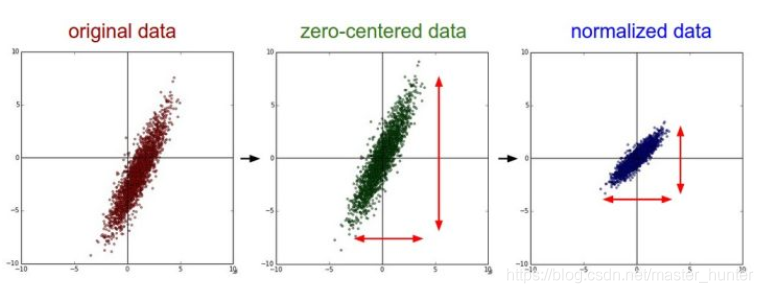
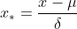

### 特征缩放（Feature scaling）：


#### 一、Training data split（训练数据分片）

常见方法：

##### 1、sklearn

```python
from sklearn.model_selection import train_test_split

import numpy as np

sample_data =np.random.random(size=(100,50))
print(sample_data)
train,test =train_test_split(sample_data,train_size=0.8)

print(test)
```

##### 2、keras

```python
history=model.fit(X, encoded_Y, batch_size=50, nb_epoch=500, validation_split = 0.2, verbose=1)
```

##### 3、pytorch

```python
train_size = int(0.8 * len(full_dataset))
test_size = len(full_dataset) - train_size
train_dataset, test_dataset = torch.utils.data.random_split(full_dataset, [train_size, test_size])
```


#### 二、数据标准化

​	数据无量纲化处理主要解决数据的可比性。数据标准化的方法有很多种，

​	常用的有：

- ​		最小—最大标准化
- ​		Z-score标准化
- ​		按小数定标标准化、等。

​		经过上述标准化处理，原始数据均转换为无量纲化指标测评值，即各指标值都处于同一个数量级别上，可以进行综合测评分析。这里我们重点讨论最常用的数据归一化处理，即将数据统一映射到[0,1]区间上。

##### 1.归一化的目标

1.把数据转换为（0,1）区间的小数，  主要是为了数据处理方便提出来的，把数据映射到0～1范围之内处理，更加便捷快速。

2.把有量纲表达式变为无量纲表达式，解决数据的可比性。

##### 2.归一化的优点

1.归一化后加快了梯度下降求最优解的速度，如果机器学习模型使用梯度下降法求最优解时，归一化往往非常有必要，否则很难收敛甚至不能收敛。

2.归一化有可能提高精度，一些分类器需要计算样本之间的距离（如欧氏距离），例如KNN。如果一个特征值域范围非常大，那么距离计算就主要取决于这个特征，从而与实际情况相悖（比如这时实际情况是值域范围小的特征更重要）




##### 3.哪些算法并不需要归一化

概率模型（树形模型）不需要归一化，因为它们不关心变量的值，而是关心变量的分布和变量之间的条件概率，如决策树、RF。而像Adaboost、SVM、LR、Knn、KMeans之类的最优化问题就需要归一化。

#### 三、数据归一化方法

Normalization (规范化 ，归一化）:

##### 1.min-max标准化：

$$ X_{normalized}=\frac{X-X_{minimum}}{X_{maximum}-X_{minimum}}$$


```python
def normalize(x):
    return (x-np.min(x))/(np.max(x)-np.min(x))
```


通过遍历feature vector里的每一个数据，将Max和Min的记录下来，并通过Max-Min作为基数（即Min=0，Max=1）进行数据的归一化处理：其中Max为样本数据的最大值，Min为样本数据的最小值。

使用numpy中的np.max()和np.min()就可找到最大和最小值。这种归一化方法比较适用在数值比较集中的情况。

这种方法有个缺陷，如果max和min不稳定，很容易使得归一化结果不稳定，使得后续使用效果也不稳定。

实际使用中可以用经验常量值来替代max和min。

ps: 将数据归一化到[a,b]区间范围的方法：

（1）首先找到原本样本数据X的最小值Min及最大值Max
（2）计算系数：k=（b-a)/(Max-Min)
（3）得到归一化到[a,b]区间的数据：Y=a+k(X-Min)  或者 Y=b+k(X-Max)


##### 2.Z-score标准化（Standardized、标准化）



最常见的标准化方法就是Z标准化，也是SPSS中最为常用的标准化方法，spss默认的标准化方法就是z-score标准化。

```python
def standarlize(x):
    return (x-np.mean(x))/(np.std(x))
```

也叫标准差标准化，这种方法给予原始数据的均值（mean）和标准差（standard deviation）进行数据的标准化。

**numpy**中mean和std函数，**sklearn**提供的**StandardScaler**方法都可以求得均值和标准差。标准化后的变量值围绕0上下波动，大于0说明高于平均水平，小于0说明低于平均水平。


https://blog.csdn.net/master_hunter/article/details/108847086

https://blog.csdn.net/xinghuanmeiying/article/details/91873329


### 类别与数字：Categorical & Numerical

Categorical 类别（分类值）
		Could not be compared 
		Could not be sorted
		The Number just is a  representation  表现形式

Numerical 数字（连续值）
		Could be compared
		Could be sorted
		The number with attribute 


为了解决Catagorical（分类值）的问题

One-hot编码

One-hot编码的缺陷

1 .2 .3. 遗漏了很多重要信息

```python
from icecream import ic

def one_hot(elements):
    pure = list(set(elements))
    vectiors=[]
    # indices=[pure.index(e) for e in elements]
    for e in elements:
        vec =[0]*len(pure)
        vec[pure.index(e)]=1
        vectiors.append(vec)
    return vectiors

ic(one_hot(['北京','上海','广州','重庆']))
#ic| one_hot(['北京','上海','广州','重庆']): [[0, 0, 1, 0], [1, 0, 0, 0], [0, 1, 0, 0], [0, 0, 0, 1]]
```


优点：
(1) 解决了 分类器不好处理离散数据 的问题。

    a. 欧式空间。在回归，分类，聚类等机器学习算法中，特征之间距离计算 或 相似度计算是非常重要的，而我们常用的距离或相似度的计算都是在欧式空间的相似度计算，计算余弦相似性，基于的就是欧式空间。
    
    b. one-hot 编码。使用 one-hot 编码，将离散特征的取值扩展到了欧式空间，离散特征的某个取值 就 对应欧式空间的某个点。将离散型特征使用 one-hot 编码，确实会让 特征之间的距离计算 更加合理。

(2) 在一定程度上也起到了 扩充特征 的作用。

 

缺点：
在文本特征表示上有些缺点就非常突出了。

(1) 它是一个词袋模型，不考虑 词与词之间的顺序（文本中词的顺序信息也是很重要的）；

(2) 它 假设词与词相互独立（在大多数情况下，词与词是相互影响的）；

(3) 它得到的 特征是离散稀疏 的 (这个问题最严重)。

##### 解决方案：One-Hot and Embedding (嵌入)


https://blog.csdn.net/qq_15192373/article/details/89552498

https://blog.csdn.net/qq_15192373/article/details/89552498


归一化：把每个特征向量（特别是奇异样本数据）的值都缩放到相同数值范围。如[0,1]或[-1,1]。最常用的归一化形式就是将特征向量调整为L1范数（就是绝对值相加），使特征向量的数值之和为1。L2范数就是欧几里得之和。 

这个方法经常用于确保数据点没有因为特征的基本性质而产生较大差异，即确保数据处于同一数量级（同一量纲），提高不同特征数据的可比性。

概率模型（树形模型）不需要归一化，因为它们不关心变量的值，而是关心变量的分布和变量之间的条件概率，如**决策树、RF**。而像**Adaboost、SVM、LR、Knn、KMeans**之类的最优化问题就需要归一化。

**Tree-based models doesn’t depend on scaling**

**Non-tree-based models hugely depend on scaling**

 

**什么时候对数据中心化？**

在聚类过程中，标准化显得尤为重要。这是因为聚类操作依赖于对类间距离和类内聚类之间的衡量。如果一个变量的衡量标准高于其他变量，那么我们使用的任何衡量标准都将受到该变量的过度影响。

在PCA降维操作之前。在主成分PCA分析之前，对变量进行标准化至关重要。 这是因为PCA给那些方差较高的变量比那些方差非常小的变量赋予更多的权重。而 标准化原始数据会产生相同的方差，因此高权重不会分配给具有较高方差的变量

KNN操作，原因类似于kmeans聚类。由于KNN需要用欧式距离去度量。标准化会让变量之间起着相同的作用。

在SVM中，使用所有跟距离计算相关的的kernel都需要对数据进行标准化。

在选择岭回归和Lasso时候，标准化是必须的。原因是正则化是有偏估计，会对权重进行惩罚。在量纲不同的情况，正则化会带来更大的偏差。

**什么时候不需要标准化？**

当采用普通的线性回归的时候，是无需标准化的。因为标准化前后，不会影响线性回归预测值。
同时，标准化不会影响logistic回归，决策树及其他一些集成学习算法：such as random forest and gradient boosting.

决策树不需要归一化的很大原因应该是：

不需要考虑特征的值，只需要考虑划分界限，比如ID3 C4.5 CART 的熵和基尼系数，研究对象只是概率分布，对数值不关心。

决策树的一些优点：

- 决策树模型可以读性好，具有描述性，有助于人工分析。简单易懂，可解释性强，且构造的树能够可视化。
- **几乎不需要数据预处理。**其他一些技术常常需要做数据标准化、哑变量的创建等等数据准备工作。**算法完全不受数据缩放的影响。**由于每个特征被单独处理，而且数据的划分**也不依赖于缩放**，因此决策树算法不需要特征预处理，比如归一化或标准化。特别是特征的尺度完全不一样时或者二元特征和连续特征同时存在时，决策树的效果同样很好。
- 使用树的成本低例如预测数据）是训练数据点(data points)数量的对数。效率高，决策树只需要一次构建，反复使用，每一次预测的最大计算次数不超过决策树的深度
- 可以同时处理数值变量和分类变量。其他的一些技术往往只能处理特定数据类型的变量。
- 可以处理多输出变量问题。
- 使用白盒模型。如果一个情况被观察到，使用逻辑判断容易表示这种规则。相反，如果是黑盒模型（例如人工神经网络），结果会非常难解释。
- 可使用统计检验来验证模型，从而可保证模型的可靠性，提高模型的可行度。
- 即使对真实模型来说，假设无效的情况下，也可以较好的适用。

决策树的一些缺点：

- 容易出现过拟合，特别是在构造了过于复杂的树的情况下。决策树学习可能创建一个过于复杂的树，并不能很好的预测数据。也就是过拟合。修剪机制（现在不支持），设置一个叶子节点需要的最小样本数量，或者数的最大深度，可以避免过拟合。
- 决策树可能是不稳定的，因为即使非常小的变异，可能会产生一颗完全不同的树。这个问题通过decision trees with an ensemble来缓解。
- 学习一颗最优的决策树是一个NP-完全问题under several aspects of optimality and even for simple concepts。因此，传统决策树算法基于启发式算法，例如贪婪算法，即每个节点创建最优决策。这些算法不能产生一个全局最优的决策树，得到的往往是一个局部最优结果。。对样本和特征随机抽样可以降低整体效果偏差。
- 概念难以学习，因为决策树没有很好的解释他们，例如，XOR, parity or multiplexer problems。对于异或、多路复用等问题，决策树表现一般，因为决策树很难去表达它们。
- 如果某些分类占优势，决策树将会创建一棵有偏差的树。因此，建议在训练之前，先抽样使样本均衡。

决策树对变量的量纲差异、离群值的存在以及有偏分布不太敏感，也就是对数据准备要求不高。

有研究表明回归模型样本量选择中，最好各组样本含量大于解释变量数的20倍。

#### 二分类之后，多分类逻辑回归的问题：


```python
from numpy.core.fromnumeric import size
from icecream import ic
import numpy as np

def one_hot(elements):
    pure = list(set(elements))
    vectiors=[]
    # indices=[pure.index(e) for e in elements]
    for e in elements:
        vec =[0]*len(pure)
        vec[pure.index(e)]=1
        vectiors.append(vec)
    return vectiors

ic(one_hot(['北京','上海','广州','重庆']))

def normalize(x):
    return (x-np.min(x))/(np.max(x)-np.min(x))

def standarlize(x):
    return (x-np.mean(x))/(np.std(x))


x= [12324,45243,32343] #3维向量x
y= [0,0,1,0,0] #分类，5分类

x= normalize(x)
# x= standarlize(x)
x= np.array(x)
weights=np.random.random(size=(3,5))  

yhat= np.dot(x,weights)
ic(yhat)
#算子,logits  

#例如 ，将x向量（10维）辩证logits算子（3维），再把logits算子,编程概率分布
#通过softmax把算子变成概率分布

def softmax(x):
    return np.exp(x)/np.sum(np.exp(x))

ic(softmax(yhat))

#逻辑回归的LOSS函数

def cross_entropy(yhat,y):
    return -np.sum(y_i * np.log(yhat_i) for y_i,yhat_i in zip(y,yhat))


ic(cross_entropy(softmax(yhat),y))

## ic| cross_entropy(softmax(yhat),y): 2.1935341863817426  输出即为loss值
```

